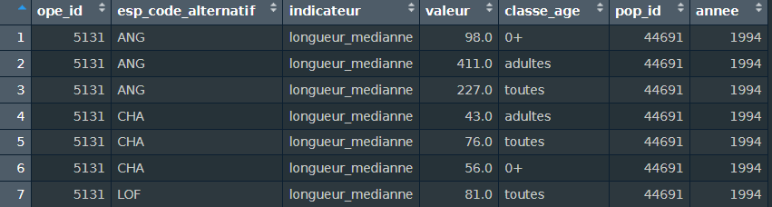
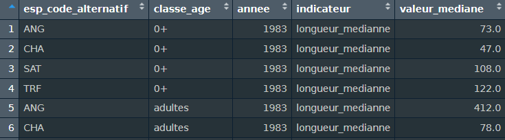

<!-- README.md is generated from README.Rmd. Please edit that file -->

```{r, include = FALSE}
knitr::opts_chunk$set(
  collapse = TRUE,
  comment = "#>"
)
```

# liste_rouge_regionale

<!-- badges: start -->
<!-- badges: end -->

# Objectif

Evaluer les tendances temporelles des poissons d'eau douce de Bretagne. Ce travail vient en appui de la révision de la liste rouge régionale.

# Approche

Il s'agit de produire une sorte de tableau de bord combinant divers indicateurs de la dynamique des populations. Ces populations sont étudiées à travers leurs densités, leur taux d'occurrence et leur distributions en taille. Les indicateurs sont calculés pour soit séparément pour les juvéniles et les adultes, soit en les combinant.

Une première analyse statistique simple consiste à estimer les tendances temporelles des indicateurs par un test de Mann-Kendall (significativité d'une tendance monotone) suivi d'une régression de Sen-Theil (pente). Dans un second temps les indicateurs serviront à caler des modèles Bayésiens de dynamique de population.

Les caractéristiques des sites seront prises en compte pour analyser les résultats.

# Constitution du jeu de données

## Sélection des sites et des opérations de pêche

On appelle ici site le *point_prelevement* de la base Aspe, caractérisé par son identifiant *pop_id*.

Dans la base Aspe de l'OFB ([Irz *et al.* 2022](https://www.kmae-journal.org/articles/kmae/full_html/2022/01/kmae220057/kmae220057.html)), nous sélectionnons des sites :

- Localisés en Bretagne.
- Qui ont été suivis pendant suffisamment longtemps et selon des protocoles adaptés pour estimer les densités.

Sur ces sites, nous sélectionnons des séries de pêches avec au moins 10 années de données sans que les opérations successives soient éloignées de plus de deux ans.

Si plusieurs pêches ont été réalisées la même année sur un site, on ne retient que la plus tardive (pêche d'automne).

## Distinction des classes d'âge

En complément de la base Aspe, un tableau indiquant pour chaque espèce la taille maximale des 0+ et la taille à maturité sexuelle est constitué. On utilise donc la longueur du poisson comme *proxy* de son âge.

## Calcul des indicateurs par opération de pêche

Certains des indicateurs sont d'abord calculés par pêche (ex : densité, longueur médiane, pourcentage de juvéniles) pour chaque classe d'âge de chaque espèce.

Chacun est stocké dans un tableau contenant les variables :

- *ope_id*
- *esp_code_alternatif* (code espèce à trois lettres)
- *classe_age* (classe d'âge codée "0+", "adultes" ou bien "toutes")
- *indicateur* (exemples : "longueur_mediane", "densité surfacique", etc.)
- *valeur* (valeur prise par l'indicateur pour cette opération)


Ces tableaux sont ensuite regroupés (empilés dans un tableau unique) pour simplifier les analyses ultérieures. Ce tableau est complété pour associer chaque opération à son site et à son année. Il contient donc, outre les variables mentionnées précédemment, *pop_id* et *annee*.



## Indicateurs régionaux

Pour les indicateurs calculés au point, on agrège chaque année leur valeur à l'échelle régionale.

Le taux d'occurrence de chaque espèce est directement calculé annuellement, à l'échelle régionale, comme le pourcentage des sites prospectés où l'espèce a été trouvée.

Ces deux tableaux sont assemblés(empilés).



## Qualité des données

### Erreurs dans la base

Des premiers traitements de cohérence interne à la baqse ont été effectués, qui ont permis de détecter des erreurs en particulier d'unité ou de saisie. Ces erreurs ont été corrigées avant de construire les indicateurs.

### Données manquantes

Il apparaît que certaines données sont manquantes.

- Si certaines longueurs individuelles manquent, elles sont soit estimées, soit remplacées par la taille médiane des individus de la même espèce sur le site.
- De nombreux poids manquent. On les estime donc tous par une relation taille-poids.
- Si des caractéristiques des sites manquent, elles sont remplacées par leur valeur moyenne.

# Estimation des tendances temporelles

Les séries d'indicateurs démographiques préparées par les étapes précédentes seront soumises à diverses analyses pour caractériser leurs tendances. On s'attachera à détecter d'éventuelles tendances monotones, sur différentes fenêtres temporelles, ainsi qu'à détecter d'éventuels points d'inflexion.

## Période

Les séries longues d'observation de la faune sont rares et d'une grande valeur en particulier car ce sont les seules permettant d'étudier les effets du changement climatique. Nous ferons donc porter une partie de nos analyses sur les séries les plus longues disponible au site ou à l'échelle régionale.

Une autre série d'analyse se focalisera sur la période à prendre en compte pour appliquer la [méthodologie Liste Rouge Régionale](https://uicn.fr/wp-content/uploads/2018/04/guide-pratique-listes-rouges-regionales-especes-menacees.pdf) (UICN, 2018), qui diffère selon les taxons. Elle est de trois fois le temps de génération ou, si cette durée est inférieure à 10 ans, 10 ans.

## Indicateurs démographiques

Les tendance populationnelles seront d'abord évaluées par site. Les méthodes restent à préciser mais sont envisagés des tests de Mann-Kendall, des ajustements fréquentistes des taux d'évolution interannuels et ajustements de modèles Bayésiens. Cette dernière approche mobilisera des outils développés par Dortel *et al.* (2022).

Les tendances sur les indicateurs régionaux seront ensuite obtenus soit en agrégeant les tendances par site, soit en estimant des tendances sur des indicateurs agrégés (eg taux d'occurrence). 

## Paramètres environnementaux

Les tendances des paramètres environnementaux seront évaluées de manière à fournir des éléments d'interprétation des tendances populationnelles. Les paramètres de profondeur et largeur moyenne, relevés au moment des pêches, seront mobilisés. On peut, en complément, envisager de collecter des relevés de température (Météo France) ou de débit journalier (HydroPortail).

# Bibliographie

Dortel E, Besnard A, Poulet N. 2022. Evolution des populations piscicoles et astacicoles de France métropolitaine. Rapport CNRS - EPHE - OFB. Centre d’Ecologie Fonctionnelle et Evolutive, Montpellier.

Irz P, Vigneron T, Poulet N, Cosson E, Point T, Baglinière E, Porcher J-P. 2022. A long-term monitoring database on fish and crayfish species in French rivers. Knowl Manag Aquat Ecosyst 423: 25.

UICN France. 2018. Guide pratique pour la réalisation de Listes rouges régionales des espèces menacées - Méthodologie de l’UICN & démarche d’élaboration. Seconde édition. Paris, France.

