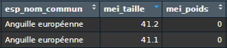

---
class: center, middle

# Objectifs

---

# Objectifs
* Analyse de la dynamique des populations de poissons d'eau douce de Bretagne

* Objectif : Evaluation, pour chaque espèce à l'échelle du site et de la région, d'indicateurs de tendances démographiques. 

Ce stage s'inscrit dans une perspective de la révision de la liste rouge régionale (Vigneron et al., 2017) et dans la poursuite des travaux à léchelle nationale menés par l'OFB (Dortel et al., 2022 ; Poulet at al., 2017)

---

# Spécificités

- Des séries chrnologiques longues (1990 - 2023)
- Des cortèges faunistiques limités (28 espèces)
- Un réseau hydrographique constitué d'une multitude de petits fleuves côtiers

```{r comment='#'}
# Visualisation des points de prélèvements présents dans l'aire géographique sélectionnée
#pop_bzh <- point_prelevement %>%
#  sf::st_as_sf(coords = c("pop_coordonnees_x", 
#                          "pop_coordonnees_y"),
#                crs = 2154) %>% 
#   aspe::geo_attribuer(bzh_buff) %>% 
#   filter(!is.na(DEP))

# mapview(
#   list(bzh_buff, mes_depts),
#   layer.name = c("Bretagne avec un buffer de 1 km", "Bretagne"),
#   col.regions = list("#440154FF", "#FDE725FF")
# ) + mapview (pop_bzh, color = "darkred", lwd =3)

```

L'étude réalisée se veut reproductible (utiliastion de Github)
---

# Construction de la base de données initiale

Affiner le périmètre d'étude : Choix des sites et des périodes temporelles sur la base de données ASPE : 
 * Ayant une série chronologique de 10 années consécutives minimum.
 * Ayant des données manquantes inférieures à 2 ans au sein des séries.
 
 
---

# Correction de la base de données

Identification des erreurs présentes dans la base de données ASPE, sur les stations retenues : 
 * Exemple : Poids d'une anguille de 40 cm = 0 
 * Exemple : Données environnementales aberrantes
 * Exemple : Stations / Points de prélèvements en doublons


---

# Construction d'un "Tableau de Bord"

Construction d'un dataframe sur R (points de départs aux analyses) : Mise en place d'un tableau comprenant différents indicateurs calculés :  
 * Densité surfacique 
 * Densité volumique
 * Longueur médianes / Q_25 / Q_75 / Ecart Interquartile
 * Biomasse

Mise en place d'une classe d'âge en fonction d'un référentiel de taille en construction : 
 * Juvéniles (0+)
 * Adultes

---

# Les calculs

Calculs d'indicateurs simples de dynamique : 
 -> Taux d'occurrence
 -> Densité Moyenne
 -> Succès reproducteur

Calage des modèles à partir des outils développés par Emmanuelle Dortel (Modèle Bayésien)

---

# Les perspectives / questions en suspend

* Sélection des différents protocoles (doit-on les mélanger ?)


---
background-image: url(`r xaringan:::karl`)
background-position: 50% 50%
class: center, bottom, inverse

# You only live once!